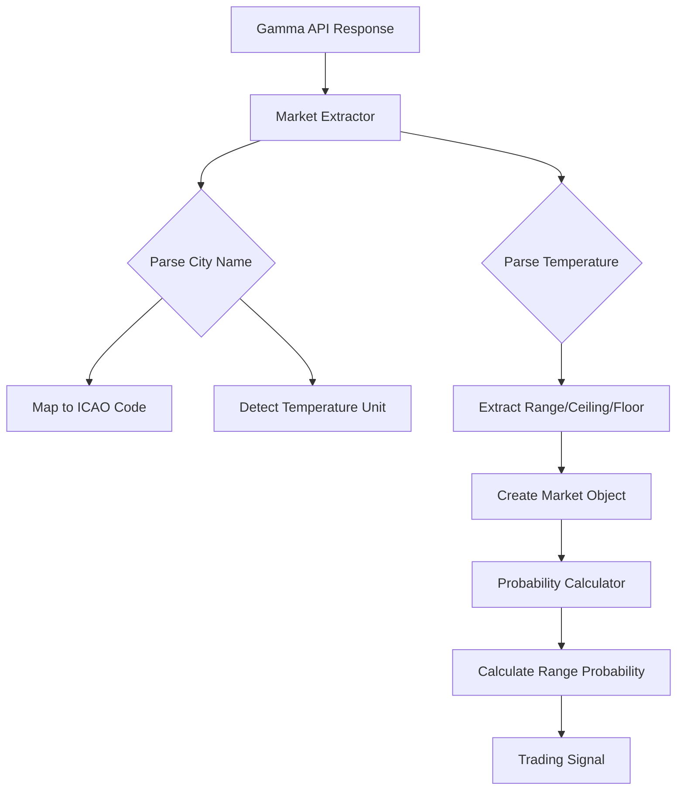

# Design Document: Market Range Enhancement

## Overview

This design enhances the weather arbitrage bot to support real-world Polymarket market formats. Current markets use city names (NYC, Chicago, London) instead of ICAO airport codes, and specify temperature ranges ("40-41°F") or open-ended bounds ("75 or higher") instead of single thresholds. The system must:

1. Map city names to ICAO codes for weather data lookup
2. Automatically detect temperature units based on city context
3. Parse three types of temperature specifications: ranges, ceilings, and floors
4. Calculate probabilities for temperature falling within ranges using normal distribution CDF
5. Maintain backward compatibility with existing single-threshold markets

The enhancement focuses on two core modules:
- **Market Extractor** (`src/market/extractor.ts`): Enhanced parsing logic for city names and temperature ranges
- **Probability Calculator** (`src/probability/calculator.ts`): Range-based probability calculation using CDF

## Architecture

### Component Interaction



### Data Flow

1. **Input**: Gamma API market response with question like "Will NYC temperature be 40-41°F on Jan 15?"
2. **City Detection**: Extract "NYC" → map to ICAO code "KLGA"
3. **Unit Detection**: "NYC" → default to Fahrenheit
4. **Range Parsing**: Extract "40-41°F" → min=40, max=41 (in Fahrenheit)
5. **Conversion**: Convert to PrecisionTemperature (Celsius with 0.1° precision)
6. **Market Creation**: Build Market object with minThreshold and maxThreshold
7. **Probability Calculation**: Compute P(40°F ≤ T_max ≤ 41°F) using normal CDF
8. **Output**: Trading signal with calculated probability and EV

### Design Decisions

**Decision 1: Extend Market Type vs Create New Type**
- **Chosen**: Extend existing Market type with minThreshold and maxThreshold fields
- **Rationale**: Maintains backward compatibility while supporting ranges. Single-threshold markets set all three fields (threshold, minThreshold, maxThreshold) to the same value.
- **Alternative**: Create separate RangeMarket type - rejected due to code duplication and complexity

**Decision 2: Infinity Representation**
- **Chosen**: Use JavaScript `Infinity` and `-Infinity` for open-ended bounds
- **Rationale**: Native JavaScript support, works correctly with CDF calculations
- **Alternative**: Use very large numbers (±1000°C) - rejected as less semantically clear

**Decision 3: City Name Priority**
- **Chosen**: ICAO codes take priority over city names if both present
- **Rationale**: ICAO codes are more precise and unambiguous
- **Alternative**: City names take priority - rejected as less reliable

## Components and Interfaces

### Enhanced Market Type

```typescript
// src/market/types.ts
export type Market = {
  readonly conditionId: string;
  readonly yesTokenId: string;
  readonly noTokenId: string;
  readonly icaoCode: ICAOCode;
  readonly threshold: PrecisionTemperature;      // Backward compatibility
  readonly minThreshold: PrecisionTemperature;   // Range lower bound
  readonly maxThreshold: PrecisionTemperature;   // Range upper bound
  readonly observationEnd: Timestamp;
  readonly ancillaryData: string;
  readonly description: string;
  readonly active: boolean;
};
```

### City Name Mapping

```typescript
// src/market/extractor.ts

type CityMapping = {
  patterns: RegExp[];
  icaoCode: ICAOCode;
  defaultUnit: 'F' | 'C';
};

const CITY_MAPPINGS: CityMapping[] = [
  {
    patterns: [/\bNYC\b/i, /\bNew York\b/i, /\bLaGuardia\b/i],
    icaoCode: 'KLGA',
    defaultUnit: 'F'
  },
  {
    patterns: [/\bChicago\b/i, /\bO'Hare\b/i, /\bOHare\b/i],
    icaoCode: 'KORD',
    defaultUnit: 'F'
  },
  {
    patterns: [/\bLondon\b/i, /\bLondon City\b/i],
    icaoCode: 'EGLC',
    defaultUnit: 'C'
  }
];

function detectCityAndUnit(text: string): {
  icaoCode: ICAOCode | null;
  defaultUnit: 'F' | 'C' | null;
} {
  for (const mapping of CITY_MAPPINGS) {
    for (const pattern of mapping.patterns) {
      if (pattern.test(text)) {
        return {
          icaoCode: mapping.icaoCode,
          defaultUnit: mapping.defaultUnit
        };
      }
    }
  }
  return { icaoCode: null, defaultUnit: null };
}
```

### Temperature Range Parsing

```typescript
// src/market/extractor.ts

type TemperatureSpec = 
  | { type: 'range'; min: number; max: number; unit: 'F' | 'C' }
  | { type: 'ceiling'; min: number; unit: 'F' | 'C' }
  | { type: 'floor'; max: number; unit: 'F' | 'C' }
  | { type: 'single'; value: number; unit: 'F' | 'C' };

function parseTemperatureSpec(
  text: string,
  defaultUnit: 'F' | 'C' | null
): TemperatureSpec | null {
  // Priority 1: Explicit unit in text overrides default
  // Priority 2: Use default unit from city detection
  // Priority 3: Fail if no unit can be determined
  
  // Range patterns: "40-41°F", "40-41 F", "40 to 41°F"
  const rangePatterns = [
    /(\d+(?:\.\d+)?)\s*-\s*(\d+(?:\.\d+)?)\s*(?:°|degrees?)?\s*([FC])\b/i,
    /(\d+(?:\.\d+)?)\s+to\s+(\d+(?:\.\d+)?)\s*(?:°|degrees?)?\s*([FC])\b/i
  ];
  
  // Ceiling patterns: "75 or higher", "75+", "> 75", "above 75"
  const ceilingPatterns = [
    /(\d+(?:\.\d+)?)\s+or\s+(?:higher|above)\s*(?:°|degrees?)?\s*([FC])\b/i,
    /(\d+(?:\.\d+)?)\+\s*(?:°|degrees?)?\s*([FC])\b/i,
    />\s*(\d+(?:\.\d+)?)\s*(?:°|degrees?)?\s*([FC])\b/i,
    /(?:above|greater than)\s+(\d+(?:\.\d+)?)\s*(?:°|degrees?)?\s*([FC])\b/i
  ];
  
  // Floor patterns: "40 or below", "< 40", "below 40"
  const floorPatterns = [
    /(\d+(?:\.\d+)?)\s+or\s+(?:below|lower|less)\s*(?:°|degrees?)?\s*([FC])\b/i,
    /<\s*(\d+(?:\.\d+)?)\s*(?:°|degrees?)?\s*([FC])\b/i,
    /(?:below|less than)\s+(\d+(?:\.\d+)?)\s*(?:°|degrees?)?\s*([FC])\b/i
  ];
  
  // Try range patterns
  for (const pattern of rangePatterns) {
    const match = text.match(pattern);
    if (match) {
      const min = parseFloat(match[1]);
      const max = parseFloat(match[2]);
      const unit = match[3].toUpperCase() as 'F' | 'C';
      
      if (min > max) {
        throw new Error(`Invalid range: min (${min}) > max (${max})`);
      }
      
      return { type: 'range', min, max, unit };
    }
  }
  
  // Try ceiling patterns
  for (const pattern of ceilingPatterns) {
    const match = text.match(pattern);
    if (match) {
      const min = parseFloat(match[1]);
      const unit = match[2].toUpperCase() as 'F' | 'C';
      return { type: 'ceiling', min, unit };
    }
  }
  
  // Try floor patterns
  for (const pattern of floorPatterns) {
    const match = text.match(pattern);
    if (match) {
      const max = parseFloat(match[1]);
      const unit = match[2].toUpperCase() as 'F' | 'C';
      return { type: 'floor', max, unit };
    }
  }
  
  // Try single threshold with explicit unit
  const singlePattern = /(\d+(?:\.\d+)?)\s*(?:°|degrees?)?\s*([FC])\b/i;
  const match = text.match(singlePattern);
  if (match) {
    const value = parseFloat(match[1]);
    const unit = match[2].toUpperCase() as 'F' | 'C';
    return { type: 'single', value, unit };
  }
  
  // Try single threshold with default unit
  if (defaultUnit) {
    const numberPattern = /(\d+(?:\.\d+)?)/;
    const match = text.match(numberPattern);
    if (match) {
      const value = parseFloat(match[1]);
      return { type: 'single', value, unit: defaultUnit };
    }
  }
  
  return null;
}
```

### Enhanced extractMarketData Function

```typescript
// src/market/extractor.ts

export function extractMarketData(
  marketData: GammaMarketResponse
): MarketExtractionResult {
  // Step 1: Try to extract ICAO code directly (backward compatibility)
  let icaoCode = extractICAOCode(marketData);
  let defaultUnit: 'F' | 'C' | null = null;
  
  // Step 2: If no ICAO code found, try city name detection
  if (!icaoCode) {
    const cityDetection = detectCityAndUnit(marketData.question);
    icaoCode = cityDetection.icaoCode;
    defaultUnit = cityDetection.defaultUnit;
    
    // Also check ancillaryData and description
    if (!icaoCode && marketData.ancillaryData) {
      const ancillaryDetection = detectCityAndUnit(marketData.ancillaryData);
      icaoCode = ancillaryDetection.icaoCode;
      defaultUnit = ancillaryDetection.defaultUnit;
    }
    
    if (!icaoCode && marketData.description) {
      const descDetection = detectCityAndUnit(marketData.description);
      icaoCode = descDetection.icaoCode;
      defaultUnit = descDetection.defaultUnit;
    }
  }
  
  if (!icaoCode) {
    return {
      success: false,
      error: 'Could not extract ICAO code or city name from market data'
    };
  }
  
  // Step 3: Parse temperature specification
  const tempSpec = parseTemperatureSpec(marketData.question, defaultUnit);
  if (!tempSpec) {
    return {
      success: false,
      error: 'Could not extract temperature specification from market data'
    };
  }
  
  // Step 4: Convert to PrecisionTemperature based on type
  let threshold: PrecisionTemperature;
  let minThreshold: PrecisionTemperature;
  let maxThreshold: PrecisionTemperature;
  
  switch (tempSpec.type) {
    case 'range':
      minThreshold = tempSpec.unit === 'F' 
        ? PrecisionTemperature.fromFahrenheit(tempSpec.min)
        : PrecisionTemperature.fromCelsius(tempSpec.min);
      maxThreshold = tempSpec.unit === 'F'
        ? PrecisionTemperature.fromFahrenheit(tempSpec.max)
        : PrecisionTemperature.fromCelsius(tempSpec.max);
      threshold = minThreshold; // Use min as legacy threshold
      break;
      
    case 'ceiling':
      minThreshold = tempSpec.unit === 'F'
        ? PrecisionTemperature.fromFahrenheit(tempSpec.min)
        : PrecisionTemperature.fromCelsius(tempSpec.min);
      maxThreshold = Infinity as PrecisionTemperature;
      threshold = minThreshold;
      break;
      
    case 'floor':
      minThreshold = -Infinity as PrecisionTemperature;
      maxThreshold = tempSpec.unit === 'F'
        ? PrecisionTemperature.fromFahrenheit(tempSpec.max)
        : PrecisionTemperature.fromCelsius(tempSpec.max);
      threshold = maxThreshold;
      break;
      
    case 'single':
      threshold = tempSpec.unit === 'F'
        ? PrecisionTemperature.fromFahrenheit(tempSpec.value)
        : PrecisionTemperature.fromCelsius(tempSpec.value);
      minThreshold = threshold;
      maxThreshold = threshold;
      break;
  }
  
  // Step 5: Extract other market data (unchanged from original)
  const conditionId = marketData.conditionId;
  
  if (!marketData.tokens || marketData.tokens.length < 2) {
    return {
      success: false,
      error: 'Market must have at least 2 tokens (Yes/No)'
    };
  }
  
  const yesToken = marketData.tokens.find(t => 
    t.outcome.toLowerCase() === 'yes'
  );
  const noToken = marketData.tokens.find(t => 
    t.outcome.toLowerCase() === 'no'
  );
  
  if (!yesToken || !noToken) {
    return {
      success: false,
      error: 'Could not find Yes/No tokens'
    };
  }
  
  const ancillaryData = marketData.ancillaryData || marketData.umadata || '';
  if (!ancillaryData) {
    return {
      success: false,
      error: 'Market missing ancillaryData field'
    };
  }
  
  const timeResult = parseObservationEndTime(ancillaryData, icaoCode);
  if (!timeResult.success) {
    return {
      success: false,
      error: `Failed to parse observation end time: ${timeResult.error}`
    };
  }
  
  // Step 6: Build Market object with new fields
  const market: Market = {
    conditionId,
    yesTokenId: yesToken.tokenId,
    noTokenId: noToken.tokenId,
    icaoCode,
    threshold,
    minThreshold,
    maxThreshold,
    observationEnd: timeResult.observationEnd,
    ancillaryData,
    description: marketData.question,
    active: marketData.active,
  };
  
  return {
    success: true,
    market
  };
}
```

### Range-Based Probability Calculation

```typescript
// src/probability/calculator.ts

/**
 * Calculate probability that maximum temperature falls within range
 * 
 * Models T_max ~ N(μ = T_current, σ = f(time_remaining, icao))
 * 
 * For finite range [min, max]:
 *   P(min ≤ T_max ≤ max) = Φ((max - μ) / σ) - Φ((min - μ) / σ)
 * 
 * For ceiling [min, ∞):
 *   P(T_max ≥ min) = 1 - Φ((min - μ) / σ)
 * 
 * For floor (-∞, max]:
 *   P(T_max ≤ max) = Φ((max - μ) / σ)
 * 
 * For single threshold (min = max):
 *   P(T_max > threshold) = 1 - Φ((threshold - μ) / σ)
 * 
 * @param currentTemp - Current temperature observation
 * @param minThreshold - Minimum temperature (can be -Infinity)
 * @param maxThreshold - Maximum temperature (can be Infinity)
 * @param icao - ICAO airport code
 * @param timeRemaining - Duration until observation end
 * @returns Probability (0.0 to 1.0) that max temp falls in range
 */
export function calculateRangeProbability(
  currentTemp: PrecisionTemperature,
  minThreshold: PrecisionTemperature,
  maxThreshold: PrecisionTemperature,
  icao: ICAOCode,
  timeRemaining: Duration
): number {
  // Extract numeric values
  const mu = PrecisionTemperature.value(currentTemp);
  const min = PrecisionTemperature.value(minThreshold);
  const max = PrecisionTemperature.value(maxThreshold);
  
  // Validate range
  if (min > max) {
    throw new Error(`Invalid range: min (${min}) > max (${max})`);
  }
  
  // Calculate time-adjusted sigma
  const sigma = calculateSigma(icao, timeRemaining);
  
  // Handle edge cases
  if (sigma === 0) {
    // No time remaining - current temp is final temp
    return (mu >= min && mu <= max) ? 1.0 : 0.0;
  }
  
  if (timeRemaining.isNegative()) {
    // Market expired - no probability
    return 0.0;
  }
  
  // Handle single threshold (backward compatibility)
  if (min === max) {
    const zScore = (min - mu) / sigma;
    const cdfValue = cdf(zScore, 0, 1);
    return Math.max(0, Math.min(1, 1 - cdfValue));
  }
  
  // Handle ceiling: [min, ∞)
  if (!isFinite(max)) {
    const zScore = (min - mu) / sigma;
    const cdfValue = cdf(zScore, 0, 1);
    return Math.max(0, Math.min(1, 1 - cdfValue));
  }
  
  // Handle floor: (-∞, max]
  if (!isFinite(min)) {
    const zScore = (max - mu) / sigma;
    const cdfValue = cdf(zScore, 0, 1);
    return Math.max(0, Math.min(1, cdfValue));
  }
  
  // Handle finite range: [min, max]
  const zScoreMax = (max - mu) / sigma;
  const zScoreMin = (min - mu) / sigma;
  
  const cdfMax = cdf(zScoreMax, 0, 1);
  const cdfMin = cdf(zScoreMin, 0, 1);
  
  const probability = cdfMax - cdfMin;
  
  // Clamp to [0, 1] range
  return Math.max(0, Math.min(1, probability));
}

/**
 * Backward-compatible wrapper for existing calculateProbability function
 * 
 * Maintains existing API for single-threshold markets.
 * Internally calls calculateRangeProbability with threshold as both min and max.
 */
export function calculateProbability(
  currentTemp: PrecisionTemperature,
  threshold: PrecisionTemperature,
  icao: ICAOCode,
  timeRemaining: Duration
): number {
  return calculateRangeProbability(
    currentTemp,
    threshold,
    threshold,
    icao,
    timeRemaining
  );
}
```

## Data Models

### Temperature Specification Types

```typescript
// Internal parsing types (not exported)
type TemperatureSpec = 
  | { type: 'range'; min: number; max: number; unit: 'F' | 'C' }
  | { type: 'ceiling'; min: number; unit: 'F' | 'C' }
  | { type: 'floor'; max: number; unit: 'F' | 'C' }
  | { type: 'single'; value: number; unit: 'F' | 'C' };
```

### City Mapping Configuration

```typescript
type CityMapping = {
  patterns: RegExp[];      // Regex patterns to match city names
  icaoCode: ICAOCode;      // Corresponding ICAO code
  defaultUnit: 'F' | 'C';  // Default temperature unit for this city
};
```

### Enhanced Market Type

```typescript
export type Market = {
  readonly conditionId: string;
  readonly yesTokenId: string;
  readonly noTokenId: string;
  readonly icaoCode: ICAOCode;
  readonly threshold: PrecisionTemperature;      // Legacy field
  readonly minThreshold: PrecisionTemperature;   // New: range lower bound
  readonly maxThreshold: PrecisionTemperature;   // New: range upper bound
  readonly observationEnd: Timestamp;
  readonly ancillaryData: string;
  readonly description: string;
  readonly active: boolean;
};
```

### Example Market Objects

**Single Threshold Market (Legacy)**:
```typescript
{
  conditionId: "0x123...",
  icaoCode: "KLGA",
  threshold: PrecisionTemperature.fromFahrenheit(75),
  minThreshold: PrecisionTemperature.fromFahrenheit(75),
  maxThreshold: PrecisionTemperature.fromFahrenheit(75),
  // ... other fields
}
```

**Range Market**:
```typescript
{
  conditionId: "0x456...",
  icaoCode: "KLGA",
  threshold: PrecisionTemperature.fromFahrenheit(40),  // min value
  minThreshold: PrecisionTemperature.fromFahrenheit(40),
  maxThreshold: PrecisionTemperature.fromFahrenheit(41),
  // ... other fields
}
```

**Ceiling Market**:
```typescript
{
  conditionId: "0x789...",
  icaoCode: "KORD",
  threshold: PrecisionTemperature.fromFahrenheit(75),
  minThreshold: PrecisionTemperature.fromFahrenheit(75),
  maxThreshold: Infinity as PrecisionTemperature,
  // ... other fields
}
```

**Floor Market**:
```typescript
{
  conditionId: "0xabc...",
  icaoCode: "EGLC",
  threshold: PrecisionTemperature.fromCelsius(10),
  minThreshold: -Infinity as PrecisionTemperature,
  maxThreshold: PrecisionTemperature.fromCelsius(10),
  // ... other fields
}
```


## Correctness Properties

A property is a characteristic or behavior that should hold true across all valid executions of a system—essentially, a formal statement about what the system should do. Properties serve as the bridge between human-readable specifications and machine-verifiable correctness guarantees.

### Property 1: City Name to ICAO Mapping

*For any* market question containing a recognized city name (NYC, New York, LaGuardia, Chicago, O'Hare, London, London City), the Market_Extractor should map it to the correct ICAO code (KLGA for NYC variants, KORD for Chicago variants, EGLC for London variants).

**Validates: Requirements 1.1, 1.2, 1.3**

### Property 2: ICAO Code Priority

*For any* market question containing both a city name and an ICAO code, the Market_Extractor should prioritize the ICAO code over the city name.

**Validates: Requirements 1.4**

### Property 3: Unrecognized City Rejection

*For any* market question containing an unrecognized city name (not in the mapping table), the Market_Extractor should return null for ICAO code.

**Validates: Requirements 1.5**

### Property 4: Temperature Unit Detection

*For any* market question, the Market_Extractor should determine the temperature unit by: (1) using explicit unit markers (°F, F, °C, C) if present, or (2) using the default unit for the detected city (Fahrenheit for NYC/Chicago, Celsius for London), or (3) returning an error if neither is available.

**Validates: Requirements 2.1, 2.2, 2.3, 2.4, 2.5**

### Property 5: Range Parsing

*For any* market question containing valid range syntax (X-Y, X to Y with temperature units), the Market_Extractor should extract min=X and max=Y, preserving decimal precision.

**Validates: Requirements 3.1, 3.2, 3.3, 3.4**

### Property 6: Invalid Range Rejection

*For any* market question where the extracted temperature range has min > max, the Market_Extractor should return an error.

**Validates: Requirements 3.5**

### Property 7: Ceiling Parsing

*For any* market question containing ceiling syntax (X or higher, X or above, X+, above X, > X, greater than X), the Market_Extractor should extract min=X and max=infinity.

**Validates: Requirements 4.1, 4.2, 4.3, 4.4, 4.5**

### Property 8: Floor Parsing

*For any* market question containing floor syntax (X or below, X or lower, X or less, below X, < X, less than X), the Market_Extractor should extract min=-infinity and max=X.

**Validates: Requirements 5.1, 5.2, 5.3, 5.4, 5.5**

### Property 9: Finite Range Probability

*For any* finite temperature range [min, max], current temperature μ, and time-adjusted standard deviation σ, the Probability_Calculator should compute P(min ≤ T_max ≤ max) = Φ((max - μ) / σ) - Φ((min - μ) / σ), where Φ is the standard normal CDF.

**Validates: Requirements 6.1, 7.1**

### Property 10: Ceiling Probability

*For any* temperature ceiling [min, ∞), current temperature μ, and time-adjusted standard deviation σ, the Probability_Calculator should compute P(T_max ≥ min) = 1 - Φ((min - μ) / σ).

**Validates: Requirements 6.2, 7.2**

### Property 11: Floor Probability

*For any* temperature floor (-∞, max], current temperature μ, and time-adjusted standard deviation σ, the Probability_Calculator should compute P(T_max ≤ max) = Φ((max - μ) / σ).

**Validates: Requirements 6.3, 7.3**

### Property 12: Single Threshold Backward Compatibility

*For any* market where minThreshold equals maxThreshold (single threshold), the Probability_Calculator should compute P(T_max > threshold) = 1 - Φ((threshold - μ) / σ) for backward compatibility with existing markets.

**Validates: Requirements 6.4, 9.2**

### Property 13: Invalid Range Error

*For any* probability calculation where min > max, the Probability_Calculator should return an error.

**Validates: Requirements 6.5**

### Property 14: Single Threshold Field Consistency

*For any* market with a single threshold (no range syntax), the Market_Extractor should set threshold, minThreshold, and maxThreshold to the same PrecisionTemperature value.

**Validates: Requirements 8.4, 9.1**

### Property 15: Range Field Population

*For any* market with a temperature range, the Market_Extractor should set minThreshold to the lower bound and maxThreshold to the upper bound of the range.

**Validates: Requirements 8.5**

### Property 16: Conflicting Range Rejection

*For any* market question containing multiple conflicting temperature ranges or mixing range with ceiling/floor syntax, the Market_Extractor should return an error.

**Validates: Requirements 10.1, 10.2**

### Property 17: Invalid Temperature Value Rejection

*For any* market question containing non-numeric temperature values, the Market_Extractor should return an error.

**Validates: Requirements 10.4**

### Property 18: Probability Bounds

*For any* probability calculation, the result should be in the range [0, 1], regardless of input values.

**Validates: Requirements 6.1, 6.2, 6.3, 6.4** (implicit correctness requirement)

### Property 19: Temperature Precision Preservation

*For any* temperature value parsed from a market question, the Market_Extractor should maintain 0.1°C precision as required by the PrecisionTemperature type.

**Validates: Requirements 3.4, 9.4** (implicit precision requirement)

### Property 20: Unit Conversion Consistency

*For any* temperature value in Fahrenheit, converting to PrecisionTemperature (Celsius) and back to Fahrenheit should preserve the original value within 0.1°C precision tolerance.

**Validates: Requirements 2.1, 2.2, 2.3, 2.4** (implicit conversion correctness)

## Error Handling

### Parsing Errors

The Market_Extractor should return descriptive errors for:

1. **No ICAO code or city name found**: "Could not extract ICAO code or city name from market data"
2. **No temperature specification found**: "Could not extract temperature specification from market data"
3. **Invalid range (min > max)**: "Invalid range: min (X) > max (Y)"
4. **Conflicting specifications**: "Market contains conflicting temperature specifications"
5. **Missing units**: "Cannot determine temperature unit: no explicit unit and no recognized city"
6. **Non-numeric values**: "Invalid temperature value: expected number, got 'X'"

### Calculation Errors

The Probability_Calculator should throw errors for:

1. **Invalid range**: `throw new Error('Invalid range: min (X) > max (Y)')`
2. **Invalid probability**: `throw new Error('Invalid probability: X. Must be between 0 and 1.')`
3. **Invalid market price**: `throw new Error('Invalid market price: X. Must be between 0 and 1.')`

### Edge Cases

1. **Expired markets**: Return probability 0.0 when timeRemaining is negative
2. **Zero time remaining**: Return deterministic probability based on current temp vs range
3. **Infinity bounds**: Handle Infinity and -Infinity correctly in CDF calculations
4. **Zero sigma**: Handle edge case where sigma = 0 (no time remaining)

## Testing Strategy

### Dual Testing Approach

The system requires both unit tests and property-based tests for comprehensive coverage:

- **Unit tests**: Verify specific examples, edge cases, and error conditions
- **Property tests**: Verify universal properties across all inputs

Both are complementary and necessary. Unit tests catch concrete bugs in specific scenarios, while property tests verify general correctness across the input space.

### Property-Based Testing Configuration

- **Library**: Use `fast-check` for TypeScript property-based testing
- **Iterations**: Minimum 100 iterations per property test (due to randomization)
- **Tagging**: Each property test must reference its design document property
- **Tag format**: `// Feature: market-range-enhancement, Property N: [property text]`
- **Coverage**: Each correctness property must be implemented by a single property-based test

### Unit Testing Focus

Unit tests should focus on:

1. **Specific examples**: Concrete market questions that demonstrate correct behavior
   - "Will NYC temperature be 40-41°F?" → KLGA, min=40°F, max=41°F
   - "Will Chicago hit 75 or higher?" → KORD, min=75°F, max=∞
   - "Will London drop below 10°C?" → EGLC, min=-∞, max=10°C

2. **Edge cases**: Boundary conditions and special values
   - Empty market questions
   - Questions with multiple temperature mentions
   - Decimal precision edge cases (40.5°F)
   - Infinity handling in probability calculations

3. **Error conditions**: Invalid inputs that should trigger errors
   - Invalid ranges (50-40°F)
   - Unrecognized cities
   - Missing temperature units
   - Non-numeric temperature values

4. **Integration points**: Component interactions
   - Market extraction → probability calculation flow
   - Temperature unit conversion accuracy
   - PrecisionTemperature precision maintenance

### Property-Based Testing Focus

Property tests should verify:

1. **City name mapping** (Property 1): Generate random market questions with city names
2. **ICAO priority** (Property 2): Generate questions with both city and ICAO code
3. **Range parsing** (Property 5): Generate random valid ranges
4. **Ceiling parsing** (Property 7): Generate random ceiling patterns
5. **Floor parsing** (Property 8): Generate random floor patterns
6. **Probability calculations** (Properties 9-12): Generate random temperatures, ranges, and time values
7. **Field consistency** (Properties 14-15): Generate random markets and verify field relationships
8. **Error handling** (Properties 6, 13, 16, 17): Generate invalid inputs and verify errors

### Test Data Generators

Property tests require custom generators for:

```typescript
// Generate random city names
const cityNameGen = fc.oneof(
  fc.constant('NYC'),
  fc.constant('New York'),
  fc.constant('Chicago'),
  fc.constant('London')
);

// Generate random temperature ranges
const rangeGen = fc.tuple(
  fc.float({ min: -50, max: 100 }),
  fc.float({ min: -50, max: 100 })
).filter(([min, max]) => min < max);

// Generate random market questions
const marketQuestionGen = fc.tuple(
  cityNameGen,
  rangeGen,
  fc.constantFrom('F', 'C')
).map(([city, [min, max], unit]) => 
  `Will ${city} temperature be ${min}-${max}°${unit}?`
);

// Generate random ICAO codes
const icaoGen = fc.constantFrom('KLGA', 'KORD', 'EGLC');

// Generate random time durations
const durationGen = fc.integer({ min: 0, max: 24 * 60 * 60 * 1000 })
  .map(ms => Duration.fromMilliseconds(ms));
```

### Example Property Test

```typescript
// Feature: market-range-enhancement, Property 5: Range Parsing
test('Range parsing extracts correct min and max', () => {
  fc.assert(
    fc.property(
      fc.float({ min: -50, max: 100 }),
      fc.float({ min: -50, max: 100 }),
      fc.constantFrom('F', 'C'),
      (min, max, unit) => {
        fc.pre(min < max); // Precondition: valid range
        
        const question = `Will temperature be ${min}-${max}°${unit}?`;
        const mockMarket = createMockMarket(question);
        const result = extractMarketData(mockMarket);
        
        if (!result.success) return false;
        
        const expectedMin = unit === 'F' 
          ? PrecisionTemperature.fromFahrenheit(min)
          : PrecisionTemperature.fromCelsius(min);
        const expectedMax = unit === 'F'
          ? PrecisionTemperature.fromFahrenheit(max)
          : PrecisionTemperature.fromCelsius(max);
        
        return (
          PrecisionTemperature.value(result.market.minThreshold) === 
            PrecisionTemperature.value(expectedMin) &&
          PrecisionTemperature.value(result.market.maxThreshold) === 
            PrecisionTemperature.value(expectedMax)
        );
      }
    ),
    { numRuns: 100 }
  );
});
```

### Integration Testing

Integration tests should verify:

1. **End-to-end flow**: Gamma API response → market extraction → probability calculation → trading signal
2. **Real market examples**: Use actual Polymarket market data from production
3. **Monitoring mode**: Verify that previously skipped markets (NYC, Chicago) now appear in logs
4. **Backward compatibility**: Verify existing single-threshold markets still work correctly

### Test Coverage Goals

- **Line coverage**: > 90% for modified files
- **Branch coverage**: > 85% for conditional logic
- **Property coverage**: 100% of correctness properties implemented as tests
- **Edge case coverage**: All identified edge cases have explicit unit tests
