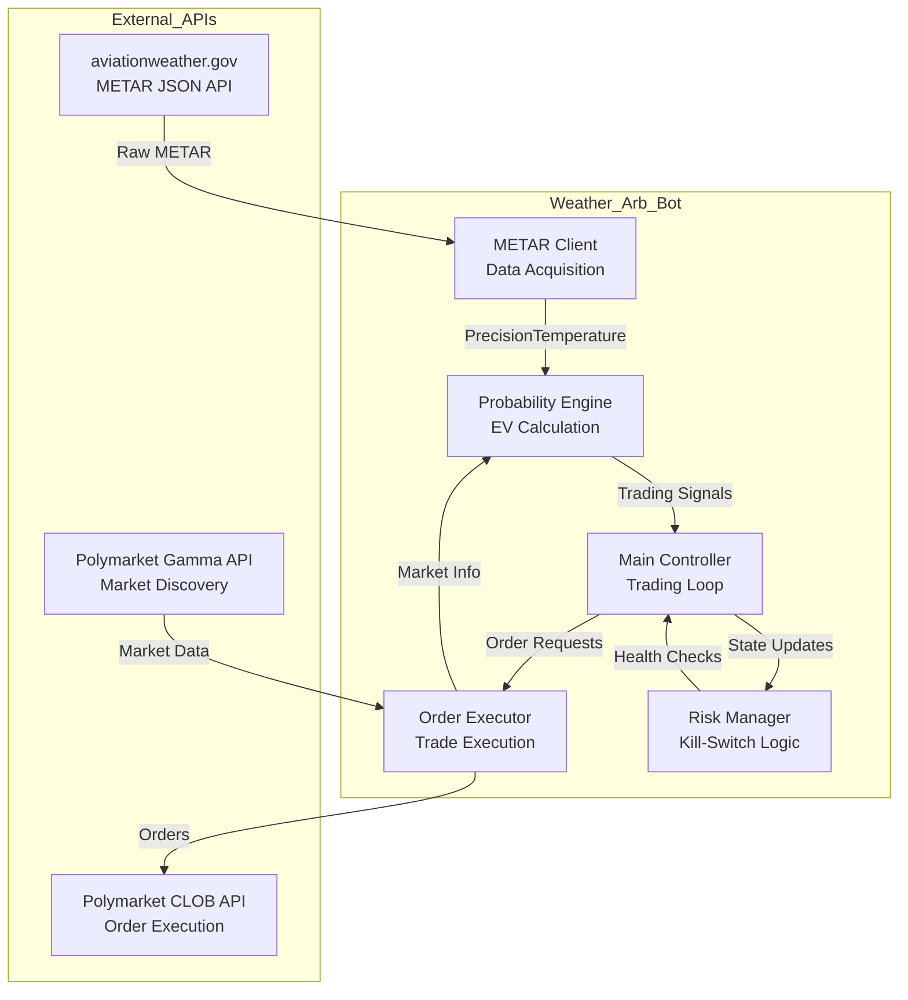
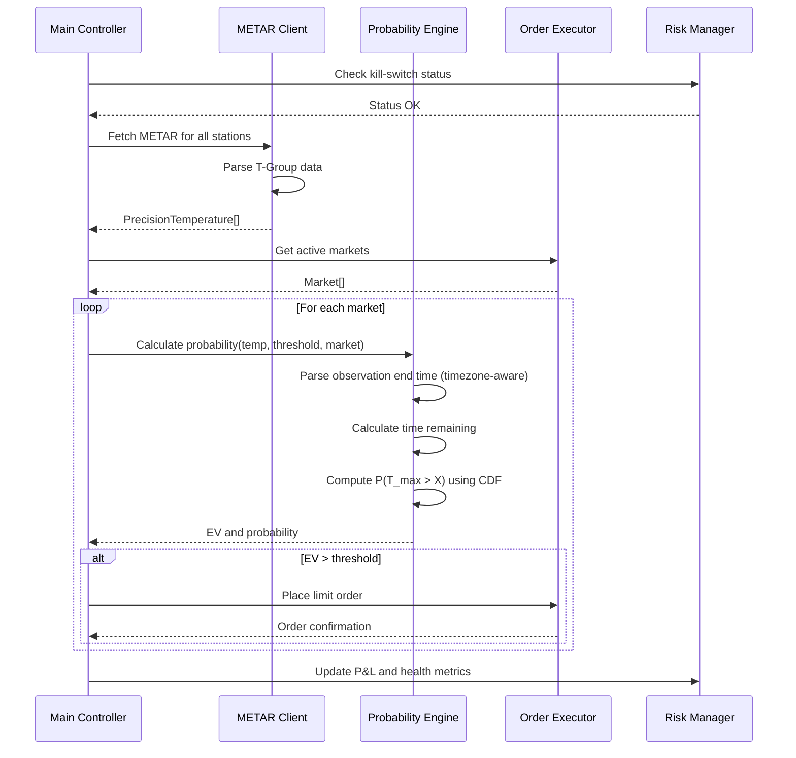

# Design Document: Weather-Arb-Bot

## Overview

Weather-Arb-Bot is a high-performance arbitrage trading system that exploits information asymmetry in Polymarket weather prediction markets. The system leverages real-time METAR aviation weather data with 0.1°C precision to identify mispriced markets before standard weather APIs update.

The architecture follows a modular design with five core components:
1. **METAR_Client**: Fetches and parses aviation weather data
2. **Probability_Engine**: Calculates temperature threshold crossing probabilities
3. **Order_Executor**: Manages Polymarket CLOB API interactions
4. **Risk_Manager**: Monitors system health and enforces kill-switches
5. **Main_Controller**: Orchestrates the trading loop and coordinates components

The system is implemented in TypeScript using Bun runtime for maximum performance, with strict type safety enforced through branded types and zod validation.

## Architecture

### System Architecture Diagram



### Component Interaction Flow



### Trading Loop Cycle

The main trading loop executes continuously with the following cycle:

1. **Health Check**: Verify no kill-switches are active
2. **Data Acquisition**: Fetch METAR data for all configured stations in parallel
3. **Market Discovery**: Retrieve active weather markets from Gamma API
4. **Signal Generation**: Calculate EV for each market using current temperature and time remaining
5. **Order Execution**: Place limit orders for markets with positive EV above threshold
6. **Risk Monitoring**: Update P&L tracking and check kill-switch conditions
7. **Wait**: Sleep for configured interval (1-5 minutes) before next cycle

## Components and Interfaces

### 1. METAR Client

**Responsibility**: Fetch and parse METAR aviation weather data with 0.1°C precision.

**Key Operations**:
- `fetchMETAR(icaoCode: ICAOCode): Promise<METARObservation>`
- `parseTGroup(rawMETAR: string): Option<PrecisionTemperature>`
- `fetchAllStations(stations: ICAOCode[]): Promise<Map<ICAOCode, METARObservation>>`

**Implementation Details**:

The METAR Client uses the aviationweather.gov JSON endpoint:
```
https://aviationweather.gov/api/data/metar?ids={ICAO}&format=json
```

T-Group parsing requires custom regex logic since standard METAR libraries ignore the Remarks section:
- Pattern: `T([01])(\d{3})([01])(\d{3})`
- First group: temperature sign (0=positive, 1=negative)
- Second group: temperature in tenths of °C (e.g., 172 = 17.2°C)
- Third/fourth groups: dewpoint (not used for this application)

**Error Handling**:
- Network failures: Exponential backoff starting at 5 seconds
- Missing T-Group: Return None and log warning
- Malformed data: Validate with zod schema, reject invalid responses

**Parallel Fetching**:
Use `Promise.all()` to fetch multiple stations concurrently, reducing total latency.

### 2. Probability Engine

**Responsibility**: Calculate probability of temperature threshold crossing using statistical models.

**Key Operations**:
- `calculateProbability(current: PrecisionTemperature, threshold: PrecisionTemperature, market: Market): Probability`
- `calculateEV(probability: Probability, marketPrice: Price): ExpectedValue`
- `parseObservationEndTime(ancillaryData: string, timezone: Timezone): Timestamp`
- `calculateTimeRemaining(observationEnd: Timestamp, now: Timestamp): Duration`

**Probability Model**:

The system models maximum temperature over remaining time period as a normal distribution:
```
T_max ~ N(μ = T_current, σ = f(time_remaining, icao))
P(T_max > X) = 1 - Φ((X - μ) / σ)
```

Where:
- `Φ` is the standard normal CDF (from @stdlib/stats-base-dists-normal-cdf)
- `σ` decreases as observation end approaches (less time for temperature to change)
- `σ` is city-specific based on historical temperature volatility
- Suggested σ function: `σ = base_σ[icao] * sqrt(hours_remaining / 24)`

**City-Specific Base Sigma**:
Different cities have different temperature volatility patterns. The base_σ should be calculated from historical data (e.g., past 30 days) for each ICAO station:

```typescript
// Example configuration based on historical volatility
export const BASE_SIGMA_CONFIG: Record<ICAOCode, number> = {
  'KLGA': 3.5,  // New York - moderate volatility
  'KORD': 4.2,  // Chicago - higher volatility (continental climate)
  'EGLC': 2.8   // London - lower volatility (maritime climate)
}
```

These values should be periodically updated (e.g., monthly) based on rolling historical data to account for seasonal variations.

**Timezone Handling Strategy** (CRITICAL):

Each market has its own observation end time in its local timezone:
- KLGA (LaGuardia): Eastern Time (ET)
- KORD (O'Hare): Central Time (CT)  
- EGLC (London City): Greenwich Mean Time (GMT)

**Implementation approach**:
1. Parse Ancillary_Data from Gamma API to extract observation end time string
2. Determine market timezone from ICAO code mapping
3. Parse time string in local timezone using date-fns-tz or Luxon
4. Convert to UTC Timestamp for calculations
5. Calculate time remaining: `observationEnd - now` (both in UTC)
6. Validate time remaining > 0 (negative means market expired)

**Example**:
```typescript
// Ancillary_Data: "...observation end: 2024-01-15 23:59..."
// Market: KLGA (Eastern Time)
const localTime = parseInTimezone("2024-01-15 23:59", "America/New_York")
const utcTime = convertToUTC(localTime) // Timestamp type
const now = getCurrentUTC() // Timestamp type
const remaining = utcTime.subtract(now) // Duration type
if (remaining.isNegative()) {
  // Market expired, do not trade
  return null
}
```

**Expected Value Calculation**:
```
EV = P(calculated) - P(market_price)
```

Only generate trading signals when EV > minimum threshold (0.05 USDC).

### 3. Order Executor

**Responsibility**: Manage Polymarket CLOB API interactions and order execution.

**Key Operations**:
- `authenticate(privateKey: string): Promise<void>`
- `discoverMarkets(icaoCodes: ICAOCode[]): Promise<Market[]>`
- `getOrderBook(tokenId: string): Promise<OrderBook>`
- `placeLimitOrder(market: Market, side: Side, price: Price, size: Size): Promise<OrderID>`
- `cancelAllOrders(): Promise<void>`

**Authentication Flow**:
1. Initialize ClobClient from @polymarket/clob-client
2. Perform L1 authentication (sign message with private key)
3. Perform L2 authentication (get API credentials)
4. Use signature_type=2 for gas-free Gnosis Safe transactions

**Market Discovery**:
Query Gamma API for active markets:
```
GET https://gamma-api.polymarket.com/markets?active=true
```

Filter by:
- Market description contains ICAO code
- Market is active (not settled)
- Settlement source matches configured station

Extract from each market:
- `condition_id`: Unique market identifier
- `yes_token_id`, `no_token_id`: Token addresses for trading
- `ancillary_data`: Contains observation end time and settlement rules

**Order Placement**:
- Use limit orders exclusively (no market orders)
- Fetch current order book before placing order
- Calculate optimal price: slightly better than best bid/ask
- Implement rate limiting: max 3,500 POST requests per 10 seconds
- Handle 429 errors with exponential backoff

**Rate Limit Management**:
- Track request timestamps in sliding window
- Throttle when approaching limits
- Log all rate limit encounters

### 4. Risk Manager

**Responsibility**: Monitor system health and enforce kill-switch conditions.

**Key Operations**:
- `checkMacroKillSwitch(): KillSwitchStatus`
- `checkDataQualityKillSwitch(metarTemp: PrecisionTemperature, noaaTemp: Temperature): KillSwitchStatus`
- `updatePnL(trade: Trade): void`
- `getRollingPnL(window: Duration): PnL`
- `activateKillSwitch(reason: KillSwitchReason): void`

**Macro Kill-Switch**:
- Track all trades in rolling 24-hour window
- Calculate cumulative P&L
- Trigger when loss > 20% of configured budget
- Actions: Cancel all orders, prevent new orders, log activation

**Data Quality Kill-Switch**:
- Compare METAR temperature with NOAA API when available
- Trigger when divergence > 5°F
- Trigger when METAR returns null/N/A
- Actions: Cancel orders, pause trading, attempt recovery every 5 minutes

**Kill-Switch Recovery**:
- Periodically check if conditions have improved
- Resume trading only when data quality restored
- Log all recovery attempts

### 5. Main Controller

**Responsibility**: Orchestrate the trading loop and coordinate all components.

**Key Operations**:
- `initialize(): Promise<void>`
- `runTradingLoop(): Promise<void>`
- `processMarket(market: Market, temperature: PrecisionTemperature): Promise<void>`
- `shutdown(): Promise<void>`

**Initialization**:
1. Validate environment variables with zod
2. Initialize all components
3. Authenticate with Polymarket CLOB
4. Discover initial markets
5. Verify kill-switches inactive

**Trading Loop**:
```typescript
while (true) {
  if (riskManager.isKillSwitchActive()) {
    await sleep(60_000) // Wait 1 minute
    continue
  }
  
  const temperatures = await metarClient.fetchAllStations(config.stations)
  const markets = await orderExecutor.discoverMarkets(config.stations)
  
  for (const market of markets) {
    const temp = temperatures.get(market.icaoCode)
    if (!temp) continue
    
    const ev = probabilityEngine.calculateEV(temp, market)
    if (ev > config.minEV) {
      if (!config.monitoringMode) {
        await orderExecutor.placeLimitOrder(market, 'BUY', ev.price, ev.size)
      }
      logger.info({ market, ev, action: 'SIGNAL' })
    }
  }
  
  await sleep(config.pollInterval)
}
```

**Monitoring Mode**:
When `MONITORING_MODE=true`:
- Execute full trading loop
- Calculate all signals
- Log signals that would have been executed
- Do NOT place actual orders
- Track prediction accuracy for validation

## Data Models

### Core Type Definitions

**Branded Types for Type Safety** (CRITICAL):

```typescript
// Branded type for 0.1°C precision temperatures
declare const PrecisionTemperatureBrand: unique symbol
export type PrecisionTemperature = number & { [PrecisionTemperatureBrand]: true }

export const PrecisionTemperature = {
  fromCelsius: (value: number): PrecisionTemperature => {
    // Round to 0.1°C precision
    return Math.round(value * 10) / 10 as PrecisionTemperature
  },
  
  fromFahrenheit: (value: number): PrecisionTemperature => {
    const celsius = (value - 32) * 5 / 9
    return PrecisionTemperature.fromCelsius(celsius)
  },
  
  toFahrenheit: (temp: PrecisionTemperature): number => {
    return (temp as number) * 9 / 5 + 32
  },
  
  value: (temp: PrecisionTemperature): number => temp as number
}

// Branded type for timezone-aware timestamps
declare const TimestampBrand: unique symbol
export type Timestamp = {
  readonly utc: Date
  readonly timezone: string
  readonly [TimestampBrand]: true
}

export const Timestamp = {
  fromUTC: (date: Date): Timestamp => ({
    utc: date,
    timezone: 'UTC',
    [TimestampBrand]: true as const
  }),
  
  fromLocalTime: (dateStr: string, timezone: string): Timestamp => {
    // Use date-fns-tz or Luxon to parse in timezone
    const utc = parseInTimezone(dateStr, timezone)
    return {
      utc,
      timezone,
      [TimestampBrand]: true as const
    }
  },
  
  now: (): Timestamp => Timestamp.fromUTC(new Date()),
  
  subtract: (t1: Timestamp, t2: Timestamp): Duration => {
    const ms = t1.utc.getTime() - t2.utc.getTime()
    return Duration.fromMilliseconds(ms)
  }
}

// Duration type for time calculations
export type Duration = {
  readonly milliseconds: number
  readonly seconds: number
  readonly minutes: number
  readonly hours: number
  isNegative: () => boolean
  isPositive: () => boolean
}

export const Duration = {
  fromMilliseconds: (ms: number): Duration => ({
    milliseconds: ms,
    seconds: ms / 1000,
    minutes: ms / 60000,
    hours: ms / 3600000,
    isNegative: () => ms < 0,
    isPositive: () => ms > 0
  })
}
```

**METAR Data Structures**:

```typescript
export type ICAOCode = 'KLGA' | 'KORD' | 'EGLC'

export type TGroupResult = {
  readonly temperature: PrecisionTemperature
  readonly dewpoint: PrecisionTemperature
  readonly rawString: string
}

export type METARObservation = {
  readonly icaoCode: ICAOCode
  readonly observationTime: Timestamp
  readonly temperature: PrecisionTemperature
  readonly rawMETAR: string
  readonly tGroup: Option<TGroupResult>
}

// Zod schema for validation
export const METARResponseSchema = z.object({
  icaoId: z.string(),
  obsTime: z.string(),
  temp: z.number(),
  rawOb: z.string()
})
```

**Market Data Structures**:

```typescript
export type Market = {
  readonly conditionId: string
  readonly yesTokenId: string
  readonly noTokenId: string
  readonly icaoCode: ICAOCode
  readonly threshold: PrecisionTemperature
  readonly observationEnd: Timestamp
  readonly ancillaryData: string
  readonly description: string
}

export type OrderBook = {
  readonly bids: Order[]
  readonly asks: Order[]
}

export type Order = {
  readonly price: Price
  readonly size: Size
}

export type Side = 'BUY' | 'SELL'
export type Price = number // 0.0 to 1.0
export type Size = number // USDC amount

export type OrderID = string

// Zod schema for Gamma API response
export const MarketSchema = z.object({
  condition_id: z.string(),
  tokens: z.array(z.object({
    token_id: z.string(),
    outcome: z.string()
  })),
  description: z.string(),
  end_date_iso: z.string(),
  // ... other fields
})
```

**Trading Signal Structures**:

```typescript
export type Probability = number // 0.0 to 1.0

export type ExpectedValue = {
  readonly probability: Probability
  readonly marketPrice: Price
  readonly ev: number // probability - marketPrice
  readonly recommendedPrice: Price
  readonly recommendedSize: Size
}

export type TradingSignal = {
  readonly market: Market
  readonly currentTemp: PrecisionTemperature
  readonly ev: ExpectedValue
  readonly timestamp: Timestamp
  readonly action: 'BUY' | 'SELL' | 'HOLD'
}
```

**Risk Management Structures**:

```typescript
export type KillSwitchStatus = {
  readonly active: boolean
  readonly reason: Option<KillSwitchReason>
  readonly activatedAt: Option<Timestamp>
}

export type KillSwitchReason = 
  | { type: 'MACRO_LOSS', loss: number, threshold: number }
  | { type: 'DATA_QUALITY', divergence: number }
  | { type: 'METAR_UNAVAILABLE' }

export type Trade = {
  readonly orderId: OrderID
  readonly market: Market
  readonly side: Side
  readonly price: Price
  readonly size: Size
  readonly timestamp: Timestamp
  readonly pnl: Option<number> // Set after settlement
}

export type PnL = {
  readonly realized: number
  readonly unrealized: number
  readonly total: number
}
```

**Configuration Structures**:

```typescript
export type Config = {
  readonly privateKey: string
  readonly funderAddress: string
  readonly polygonRpcUrl: string
  readonly targetStations: ICAOCode[]
  readonly minEV: number
  readonly budget: number
  readonly pollInterval: number // milliseconds
  readonly monitoringMode: boolean
}

// Zod schema for environment validation
export const ConfigSchema = z.object({
  POLYMARKET_PK: z.string().regex(/^[0-9a-fA-F]{64}$/),
  POLYMARKET_FUNDER: z.string().regex(/^0x[0-9a-fA-F]{40}$/),
  POLYGON_RPC_URL: z.string().url(),
  TARGET_ICAO: z.string(),
  MIN_EV: z.string().transform(Number).default('0.05'),
  BUDGET: z.string().transform(Number),
  POLL_INTERVAL: z.string().transform(Number).default('300000'),
  MONITORING_MODE: z.string().transform(v => v === 'true').default('false')
})
```

### Timezone Mapping

**ICAO to Timezone Mapping**:

```typescript
export const ICAO_TIMEZONE_MAP: Record<ICAOCode, string> = {
  'KLGA': 'America/New_York',    // Eastern Time
  'KORD': 'America/Chicago',     // Central Time
  'EGLC': 'Europe/London'        // Greenwich Mean Time
}

export function getTimezoneForICAO(icao: ICAOCode): string {
  return ICAO_TIMEZONE_MAP[icao]
}
```

This mapping is used by the Probability Engine to correctly parse observation end times from Ancillary_Data.

## Correctness Properties

*A property is a characteristic or behavior that should hold true across all valid executions of a system—essentially, a formal statement about what the system should do. Properties serve as the bridge between human-readable specifications and machine-verifiable correctness guarantees.*

Before defining the correctness properties, I need to analyze which acceptance criteria are testable as properties, examples, or edge cases.


### Property Reflection

After analyzing all acceptance criteria, I identified the following redundancies:

**Redundant Properties to Remove:**
- 3.7 (same as 3.6 - σ adjustment based on time remaining)
- 6.2 (same as 6.1 - EV threshold comparison)
- 8.4 (same as 7.3 - kill-switch cancels orders)
- 9.5 (same as 1.3 - exponential backoff for errors)
- 10.4 (same as 7.5 - kill-switch logging)
- 12.5 (inverse of 12.1 - monitoring mode behavior)
- 14.2 (same as 11.4 - zod validation at startup)
- 14.10 (same as 14.3 - validation error handling)

**Properties to Combine:**
- 7.3 and 7.4 can be combined into one property about kill-switch preventing trading
- 10.1, 10.2, 10.3 can be combined into one property about comprehensive logging
- 11.6 and 11.7 can be combined into one property about configuration validation

After eliminating redundancies, the following unique, testable properties remain:

### Correctness Properties

**Property 1: T-Group Parsing Correctness**
*For any* valid T-Group string in format T[sign][temp][sign][dewpoint], parsing should correctly extract the temperature with proper sign and 0.1°C precision.
**Validates: Requirements 2.1, 2.4, 2.5**

**Property 2: T-Group Round-Trip Consistency**
*For any* PrecisionTemperature value, encoding to T-Group format then parsing back should produce an equivalent temperature value.
**Validates: Requirements 2.5**

**Property 3: Temperature Unit Conversion Accuracy**
*For any* PrecisionTemperature in Celsius, converting to Fahrenheit and back to Celsius should produce the original value within 0.1°C precision.
**Validates: Requirements 2.7**

**Property 4: Invalid T-Group Rejection**
*For any* malformed T-Group string (wrong format, invalid characters, incorrect length), parsing should return None and not throw exceptions.
**Validates: Requirements 2.6**

**Property 5: Timezone-Aware Time Parsing** (CRITICAL)
*For any* observation end time string and ICAO code, parsing in the market's local timezone (from ICAO_TIMEZONE_MAP) then converting to UTC should produce a consistent Timestamp regardless of the system's local timezone.
**Validates: Requirements 3.4**

**Property 6: Time Remaining Calculation Correctness** (CRITICAL)
*For any* two Timestamps (observation end and current time, both in UTC), the calculated time remaining should equal the difference in milliseconds, and should be negative if observation end is in the past.
**Validates: Requirements 3.5, 3.9**

**Property 7: Standard Deviation Decreases with Time**
*For any* ICAO code and time remaining value, the calculated standard deviation σ should decrease monotonically as time remaining approaches zero, should never be negative, and should use the city-specific base_σ value.
**Validates: Requirements 3.6**

**Property 8: Expected Value Calculation**
*For any* calculated probability P and market price M (both in range [0, 1]), the expected value should equal P - M.
**Validates: Requirements 3.8**

**Property 9: Expired Market Signal Suppression** (CRITICAL)
*For any* market with negative time remaining (observation end in the past), no trading signal should be generated regardless of EV.
**Validates: Requirements 3.9**

**Property 10: Market Filtering by ICAO**
*For any* list of markets and set of target ICAO codes, filtered markets should only include those whose settlement source matches one of the target codes.
**Validates: Requirements 4.2, 4.6**

**Property 11: Ancillary Data Parsing Completeness**
*For any* valid Ancillary_Data string from Gamma API, parsing should successfully extract observation end time and settlement rules, or return an error if data is malformed.
**Validates: Requirements 4.4**

**Property 12: Limit Order Type Enforcement**
*For any* order placed by the system, the order type should be "LIMIT" and never "MARKET".
**Validates: Requirements 5.3**

**Property 13: EV Threshold Filtering**
*For any* calculated EV value, a trading signal should only be generated if EV > minimum threshold (0.05), and the signal should not be generated if EV ≤ threshold.
**Validates: Requirements 6.1**

**Property 14: Position Sizing Consistency**
*For any* EV value and available capital, the calculated position size should be deterministic, non-negative, and not exceed available capital.
**Validates: Requirements 6.3**

**Property 15: Market Prioritization by EV**
*For any* list of markets with positive EV, sorting by EV descending should place the highest EV market first.
**Validates: Requirements 6.4**

**Property 16: Rolling P&L Calculation**
*For any* sequence of trades within a 24-hour window, the cumulative P&L should equal the sum of individual trade P&Ls, and trades outside the window should not be included.
**Validates: Requirements 7.1**

**Property 17: Macro Kill-Switch Activation**
*For any* rolling 24-hour P&L and configured budget, if loss > 20% of budget, the macro kill-switch should activate.
**Validates: Requirements 7.2**

**Property 18: Kill-Switch Trading Prevention**
*For any* active kill-switch (macro or data quality), all open orders should be cancelled and new order placement attempts should be rejected.
**Validates: Requirements 7.3, 7.4**

**Property 19: Temperature Divergence Detection**
*For any* METAR temperature and NOAA temperature (when both available), if absolute difference > 5°F, the data quality kill-switch should activate.
**Validates: Requirements 8.1, 8.2**

**Property 20: Null Data Kill-Switch**
*For any* METAR fetch result that is null, N/A, or undefined, the data quality kill-switch should activate immediately.
**Validates: Requirements 8.3**

**Property 21: Exponential Backoff Pattern**
*For any* sequence of consecutive API errors, retry delays should follow exponential backoff pattern (e.g., 5s, 10s, 20s, 40s) up to a maximum delay.
**Validates: Requirements 1.3, 9.1**

**Property 22: Rate Limit Tracking Accuracy**
*For any* sequence of API requests within a 10-second sliding window, the tracked request count should equal the actual number of requests made in that window.
**Validates: Requirements 9.2**

**Property 23: Rate Limit Throttling**
*For any* request count approaching the limit (e.g., > 90% of 3,500), the next request should be delayed to avoid exceeding the limit.
**Validates: Requirements 9.3**

**Property 24: Comprehensive Logging**
*For any* significant system event (METAR fetch, probability calculation, order placement, kill-switch activation), a log entry should be created with all required fields (timestamp, relevant IDs, input/output values).
**Validates: Requirements 6.5, 7.5, 10.1, 10.2, 10.3**

**Property 25: Dual Log Destination**
*For any* log entry created, it should appear in both console output (stdout) and persistent file storage.
**Validates: Requirements 10.5**

**Property 26: Configuration Validation**
*For any* configuration object, validation should reject invalid formats (non-hex private keys, invalid URLs, malformed ICAO codes) and accept valid formats.
**Validates: Requirements 11.5, 11.6, 11.7**

**Property 27: Monitoring Mode Order Suppression**
*For any* trading signal generated when MONITORING_MODE=true, the signal should be logged but no actual order should be placed.
**Validates: Requirements 12.1, 12.2**

**Property 28: Brier Score Calculation**
*For any* set of probability predictions and binary outcomes, the Brier score should equal the mean squared error: (1/N) * Σ(prediction - outcome)².
**Validates: Requirements 12.4**

**Property 29: API Response Validation**
*For any* external API response (METAR, Gamma, CLOB), validation with zod schema should reject responses missing required fields or with incorrect types.
**Validates: Requirements 14.3**

## Error Handling

### Error Categories

The system handles four categories of errors:

1. **Network Errors**: API unavailability, timeouts, connection failures
2. **Data Errors**: Malformed responses, missing fields, invalid values
3. **Business Logic Errors**: Negative time remaining, expired markets, insufficient capital
4. **System Errors**: Kill-switch activation, rate limits, configuration errors

### Error Handling Strategies

**Network Errors**:
- Implement exponential backoff with jitter
- Log all retry attempts with timestamps
- Continue operation for other markets if one station fails
- Activate data quality kill-switch after N consecutive failures

**Data Errors**:
- Validate all external data with zod schemas
- Reject invalid data and log detailed error messages
- Return Option types (Some/None) for parsing operations
- Never throw exceptions for expected parsing failures

**Business Logic Errors**:
- Validate preconditions before calculations (e.g., time remaining > 0)
- Skip markets that fail validation rather than crashing
- Log all validation failures for debugging
- Use Result types for operations that can fail

**System Errors**:
- Gracefully shut down on fatal errors (invalid configuration)
- Activate kill-switches for recoverable errors (data quality)
- Provide clear error messages for operators
- Implement health checks for monitoring

### Error Recovery

**Automatic Recovery**:
- Data quality kill-switch: Retry every 5 minutes
- Network errors: Exponential backoff with max delay
- Rate limits: Wait for window to reset

**Manual Recovery**:
- Macro kill-switch: Requires operator intervention
- Configuration errors: Requires restart with valid config
- Fatal system errors: Requires code fix and redeployment

### Error Logging

All errors should be logged with:
- Timestamp (UTC)
- Error category and type
- Context (market ID, ICAO code, etc.)
- Stack trace for unexpected errors
- Recovery action taken

## Testing Strategy

### Dual Testing Approach

The system requires both unit tests and property-based tests for comprehensive coverage:

**Unit Tests**: Validate specific examples, edge cases, and integration points
- Specific T-Group parsing examples (positive/negative temps, edge values)
- Specific timezone conversions (DST transitions, leap seconds)
- Mock API responses for integration testing
- Kill-switch activation scenarios
- Configuration validation examples

**Property-Based Tests**: Verify universal properties across all inputs
- Generate random temperatures, timestamps, and market data
- Verify properties hold for all generated inputs
- Minimum 100 iterations per property test
- Each test references its design document property

### Property-Based Testing Configuration

**Library**: Use fast-check for TypeScript property-based testing

**Test Configuration**:
```typescript
import fc from 'fast-check'

// Example property test
test('Property 2: T-Group Round-Trip Consistency', () => {
  fc.assert(
    fc.property(
      fc.float({ min: -50, max: 50, noNaN: true }), // Generate random temps
      (tempCelsius) => {
        const precision = PrecisionTemperature.fromCelsius(tempCelsius)
        const tGroup = encodeTGroup(precision)
        const parsed = parseTGroup(tGroup)
        
        expect(parsed.isSome()).toBe(true)
        expect(parsed.unwrap().temperature).toBeCloseTo(
          PrecisionTemperature.value(precision),
          1 // 0.1°C precision
        )
      }
    ),
    { numRuns: 100 } // Minimum 100 iterations
  )
})
```

**Test Tagging**:
Each property test must include a comment referencing the design property:
```typescript
// Feature: weather-arb-bot, Property 2: T-Group Round-Trip Consistency
```

### Test Coverage Requirements

**Critical Path Coverage**:
- METAR fetching and T-Group parsing: 100%
- Timezone-aware time calculations: 100%
- Probability calculations: 100%
- Kill-switch logic: 100%
- Order execution: 90% (exclude external API calls)

**Property Test Coverage**:
- All 29 correctness properties must have corresponding property tests
- Each property test must run minimum 100 iterations
- Property tests should use realistic value ranges

**Integration Test Coverage**:
- End-to-end trading cycle (monitoring mode)
- API authentication flow
- Market discovery and filtering
- Error recovery scenarios

### Testing Priorities

**Phase 1: Core Logic** (Must pass before deployment)
- Properties 1-9: Temperature parsing and probability calculations
- Properties 17-20: Kill-switch logic
- Property 26: Configuration validation

**Phase 2: Trading Logic** (Must pass before live trading)
- Properties 10-16: Market filtering and signal generation
- Properties 21-23: Rate limiting and backoff
- Properties 27-28: Monitoring mode

**Phase 3: Operational** (Must pass for production readiness)
- Properties 24-25: Logging
- Property 29: API validation
- Integration tests for full trading cycle

### Monitoring Mode Testing

Before live trading, run in monitoring mode for minimum 7 days:
- Collect all trading signals that would have been executed
- Compare predicted probabilities with actual outcomes
- Calculate Brier score to measure accuracy
- Verify no false positives (signals for expired markets)
- Validate timezone handling across DST transitions

**Success Criteria for Live Trading**:
- Brier score < 0.15 (good calibration)
- Zero signals for expired markets
- No data quality kill-switch activations
- Successful handling of DST transitions
- Accurate P&L tracking in monitoring mode


## Deployment and Configuration

### Docker Configuration

**Dockerfile**:
```dockerfile
FROM oven/bun:latest

WORKDIR /app

# Copy package files
COPY package.json bun.lockb ./

# Install dependencies
RUN bun install --frozen-lockfile

# Copy source code
COPY src/ ./src/
COPY tsconfig.json ./

# Build TypeScript
RUN bun build src/index.ts --outdir dist --target bun

# Run the bot
CMD ["bun", "run", "dist/index.js"]
```

**docker-compose.yml**:
```yaml
version: '3.8'

services:
  weather-arb-bot:
    build: .
    env_file:
      - .env
    volumes:
      - ./logs:/app/logs
    restart: unless-stopped
    logging:
      driver: "json-file"
      options:
        max-size: "10m"
        max-file: "3"
```

### Environment Variables

**Required Variables**:
```bash
# Polymarket Authentication
POLYMARKET_PK=<64-character-hex-private-key>
POLYMARKET_FUNDER=<0x-prefixed-ethereum-address>

# Blockchain RPC
POLYGON_RPC_URL=https://polygon-rpc.com

# Trading Configuration
TARGET_ICAO=KLGA,KORD,EGLC
MIN_EV=0.05
BUDGET=1000
POLL_INTERVAL=300000  # 5 minutes in milliseconds

# Operational Mode
MONITORING_MODE=true  # Set to false for live trading
```

**Validation Schema**:
```typescript
export const ConfigSchema = z.object({
  POLYMARKET_PK: z.string()
    .regex(/^[0-9a-fA-F]{64}$/, 'Private key must be 64-character hex string'),
  
  POLYMARKET_FUNDER: z.string()
    .regex(/^0x[0-9a-fA-F]{40}$/, 'Funder must be valid Ethereum address'),
  
  POLYGON_RPC_URL: z.string()
    .url('RPC URL must be valid HTTP/HTTPS URL'),
  
  TARGET_ICAO: z.string()
    .transform(s => s.split(',').map(c => c.trim()))
    .pipe(z.array(z.enum(['KLGA', 'KORD', 'EGLC']))),
  
  MIN_EV: z.string()
    .transform(Number)
    .pipe(z.number().min(0).max(1))
    .default('0.05'),
  
  BUDGET: z.string()
    .transform(Number)
    .pipe(z.number().positive()),
  
  POLL_INTERVAL: z.string()
    .transform(Number)
    .pipe(z.number().min(60000)) // Minimum 1 minute
    .default('300000'),
  
  MONITORING_MODE: z.string()
    .transform(v => v.toLowerCase() === 'true')
    .default('true')
})
```

### Project Structure

```
weather-arb-bot/
├── src/
│   ├── index.ts                 # Main entry point
│   ├── config.ts                # Configuration and validation
│   ├── types.ts                 # Type definitions and branded types
│   ├── metar/
│   │   ├── client.ts            # METAR fetching
│   │   ├── parser.ts            # T-Group parsing
│   │   └── types.ts             # METAR-specific types
│   ├── probability/
│   │   ├── engine.ts            # Probability calculations
│   │   ├── timezone.ts          # Timezone handling
│   │   └── types.ts             # Probability-specific types
│   ├── trading/
│   │   ├── executor.ts          # Order execution
│   │   ├── market-discovery.ts  # Market discovery
│   │   └── types.ts             # Trading-specific types
│   ├── risk/
│   │   ├── manager.ts           # Risk management
│   │   ├── kill-switch.ts       # Kill-switch logic
│   │   └── types.ts             # Risk-specific types
│   ├── utils/
│   │   ├── logger.ts            # Logging utilities
│   │   ├── retry.ts             # Retry and backoff logic
│   │   └── rate-limiter.ts      # Rate limiting
│   └── __tests__/
│       ├── unit/                # Unit tests
│       └── property/            # Property-based tests
├── logs/                        # Log files (mounted volume)
├── .env                         # Environment variables
├── .env.example                 # Example configuration
├── package.json
├── bun.lockb
├── tsconfig.json
├── Dockerfile
├── docker-compose.yml
└── README.md
```

### Logging Configuration

**Log Levels**:
- ERROR: System errors, kill-switch activations, fatal failures
- WARN: Data quality issues, retry attempts, validation failures
- INFO: Trading signals, order placements, market updates
- DEBUG: Detailed calculation steps, API responses

**Log Format**:
```typescript
{
  timestamp: '2024-01-15T12:34:56.789Z',
  level: 'INFO',
  component: 'ProbabilityEngine',
  event: 'SIGNAL_GENERATED',
  data: {
    market: 'KLGA_temp_above_75F',
    currentTemp: 72.3,
    threshold: 75.0,
    probability: 0.23,
    marketPrice: 0.15,
    ev: 0.08,
    action: 'BUY'
  }
}
```

**Log Rotation**:
- Max file size: 10MB
- Max files: 3 (30MB total)
- Rotation: Daily at midnight UTC
- Compression: gzip for archived logs

### Monitoring and Alerting

**Health Checks**:
- METAR API connectivity
- Polymarket API connectivity
- Kill-switch status
- Last successful trade timestamp
- P&L tracking

**Alert Conditions**:
- Kill-switch activation (immediate alert)
- No METAR data for > 10 minutes
- No market updates for > 5 minutes
- P&L loss > 10% (warning)
- P&L loss > 20% (critical - kill-switch)

**Metrics to Track**:
- Trading signals generated per hour
- Orders placed per hour
- Average EV of executed trades
- Brier score (prediction accuracy)
- API error rates
- Average latency (METAR fetch to order placement)

### Security Considerations

**Private Key Management**:
- Never commit private keys to version control
- Use environment variables or secrets management
- Rotate keys periodically
- Use separate keys for testing and production

**API Security**:
- Validate all external API responses
- Implement rate limiting to avoid bans
- Use HTTPS for all API calls
- Log all authentication attempts

**Docker Security**:
- Run container as non-root user
- Limit container resources (CPU, memory)
- Use read-only filesystem where possible
- Scan images for vulnerabilities

### Operational Procedures

**Startup Procedure**:
1. Validate environment variables
2. Test METAR API connectivity
3. Test Polymarket API connectivity
4. Authenticate with CLOB API
5. Discover initial markets
6. Verify kill-switches inactive
7. Start trading loop

**Shutdown Procedure**:
1. Stop accepting new signals
2. Cancel all open orders
3. Log final P&L
4. Flush logs to disk
5. Close API connections
6. Exit gracefully

**Emergency Shutdown**:
- Trigger macro kill-switch manually
- Cancel all orders immediately
- Stop trading loop
- Preserve logs for analysis
- Alert operators

**Recovery Procedure**:
1. Identify root cause of failure
2. Fix configuration or code issue
3. Test in monitoring mode
4. Verify kill-switches reset
5. Resume trading with reduced position sizes
6. Gradually increase to normal operation

## Implementation Notes

### Critical Implementation Details

**Timezone Handling** (CRITICAL):
- Always use Timestamp type with explicit timezone
- Never use raw Date objects for time calculations
- Parse observation end times in market's local timezone
- Convert all times to UTC before arithmetic
- Test timezone handling across DST transitions
- Validate time remaining is positive before trading

**Temperature Precision** (CRITICAL):
- Always use PrecisionTemperature type for 0.1°C values
- Never mix PrecisionTemperature with raw numbers
- Round all temperature values to 0.1°C precision
- Validate temperature conversions with round-trip tests
- Use branded types to prevent type confusion

**Type Safety**:
- Enable strict TypeScript compiler options
- Use branded types for domain-specific values
- Validate all external data with zod schemas
- Use Option and Result types for fallible operations
- Never use `any` type

**Performance Optimization**:
- Fetch multiple METAR stations in parallel
- Cache market data for 60 seconds
- Use connection pooling for API calls
- Minimize allocations in hot paths
- Profile probability calculations

**Testing Requirements**:
- Write property tests before implementation
- Run property tests with minimum 100 iterations
- Test timezone handling with multiple timezones
- Test DST transitions explicitly
- Validate all error handling paths
- Test kill-switch activation and recovery

### Development Workflow

**Phase 1: Core Infrastructure** (Week 1)
- Set up project structure and TypeScript configuration
- Implement branded types (PrecisionTemperature, Timestamp)
- Implement configuration validation with zod
- Set up logging infrastructure
- Write property tests for type conversions

**Phase 2: Data Acquisition** (Week 1-2)
- Implement METAR client
- Implement T-Group parsing with property tests
- Implement timezone handling with property tests
- Test with real METAR data from all stations
- Validate parsing accuracy

**Phase 3: Probability Engine** (Week 2)
- Implement probability calculations
- Implement timezone-aware time remaining calculations
- Write property tests for all probability properties
- Validate against known examples
- Test edge cases (expired markets, DST transitions)

**Phase 4: Trading Integration** (Week 3)
- Implement Polymarket CLOB authentication
- Implement market discovery
- Implement order execution (monitoring mode only)
- Write property tests for trading logic
- Test with testnet if available

**Phase 5: Risk Management** (Week 3)
- Implement kill-switch logic
- Implement P&L tracking
- Implement rate limiting
- Write property tests for risk management
- Test kill-switch activation and recovery

**Phase 6: Monitoring and Validation** (Week 4+)
- Run in monitoring mode for 7+ days
- Collect prediction accuracy metrics
- Calculate Brier scores
- Validate timezone handling in production
- Test across DST transitions
- Analyze false positives and false negatives

**Phase 7: Live Trading** (After validation)
- Disable monitoring mode
- Start with small position sizes
- Monitor closely for first 24 hours
- Gradually increase to full position sizes
- Continuous monitoring and optimization

### Known Limitations and Future Enhancements

**Current Limitations**:
- Only supports three ICAO stations (KLGA, KORD, EGLC)
- Simple normal distribution model (could use more sophisticated models)
- No dynamic position sizing based on Kelly criterion
- No portfolio optimization across multiple markets
- No machine learning for σ estimation

**Future Enhancements**:
- Add more ICAO stations and markets
- Implement automated base_σ calculation from rolling historical data (e.g., past 30 days)
- Add seasonal adjustments to base_σ values
- Implement more sophisticated probability models (GARCH, historical volatility)
- Add Kelly criterion for optimal position sizing
- Implement portfolio optimization
- Add machine learning for parameter estimation
- Add backtesting framework
- Add performance analytics dashboard
- Implement automated parameter tuning

### Success Metrics

**Technical Metrics**:
- Uptime: > 99% during market hours
- Latency: < 5 seconds per trading cycle
- Error rate: < 1% of API calls
- Property test pass rate: 100%

**Trading Metrics**:
- Brier score: < 0.15 (good calibration)
- Positive EV capture rate: > 80%
- False positive rate: < 5%
- Average trade P&L: Positive

**Operational Metrics**:
- Zero kill-switch false positives
- Zero trades on expired markets
- Zero timezone-related errors
- Successful DST transition handling

